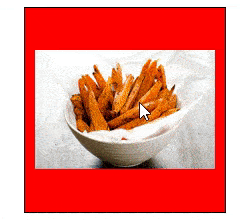

# SwiperBox
Pure javascript Swipe box

support touch and mouse
on click and on swipe events ...



example #1
```
<!doctype html><html>
<head>
<meta charset="utf-8">
<meta name="viewport" content="width=device-width, initial-scale=1.0, user-scalable=0, minimum-scale=1.0, maximum-scale=1.0"/>
<script src="https://raw.githubusercontent.com/vladimirnetworks/SwiperBox/master/SwiperBox.js"></script>

<style>
.mygal {border:1px solid black;}
.mygal .myitem {width:100%;height:100%;text-align:center;background-color:red;}
.mygal .myitem img {width:90%;position:absolute;left:-100%;right:-100%;top:-100%;bottom:-100%;margin:auto;}
</style>

</head>

<body>
<script>

// you can make a swipe gallery with pure html
var mySwipe = new SwiperBox({
					items:
						[
						'<div class="myitem"></div>',
						'<div class="myitem"></div>',
						'<div class="myitem"></div>'
						]
						
					});

//HTMLElement is the main elemnt and it is accessable for do any thing you can do with a html object	
			
mySwipe.HTMLElement.style.width = "200px";
mySwipe.HTMLElement.style.width = "200px"

mySwipe.HTMLElement.classList.add("mygal");

//onClick is trigger when user click on a element
mySwipe.onClick = function(index,elem) {
		alert("clicked on index"+index);
}
document.getElementsByTagName("body")[0].appendChild(mySwipe.HTMLElement);


</script>
</body>
</html>
```

example #2
```
<!doctype html><html>
<head>
<meta charset="utf-8">
<meta name="viewport" content="width=device-width, initial-scale=1.0, user-scalable=0, minimum-scale=1.0, maximum-scale=1.0"/>
<script src="https://raw.githubusercontent.com/vladimirnetworks/SwiperBox/master/SwiperBox.js"></script>

<style>
.mygal {border:1px solid black;}
.mygal .myitem {width:100%;height:100%;text-align:center;background-color:red;}
.mygal .myitem img {width:90%;position:absolute;left:-100%;right:-100%;top:-100%;bottom:-100%;margin:auto;}
</style>

</head>

<body>
<script>

// you can also use html object
var item1 = document.createElement("div");
item1.innerHTML = "i am item #1";

var item2 = document.createElement("div");
item2.innerHTML = "i am item #2";

var mySwipe = new SwiperBox({
					items:
						[
						item1,
						item2
						]
					,
					// ratio is use when width is percentage or height is not defined , defult ratio is 1:1 but it can be change with any thing all you need is a tiny empty png ratio file (10x10 pixel is 1:1 , 10x5 pixel=> is 2:1 )
					ratio:"https://raw.githubusercontent.com/vladimirnetworks/SwiperBox/master/ratio2.png"					
					});

mySwipe.HTMLElement.style.width = "20%";
mySwipe.HTMLElement.classList.add("mygal");

//onSwipe is trigger when user swipe on a elemtn
mySwipe.onSwipe = function(index,elem) {
	elem.innerHTML = "swiped to index"+index;
}

document.getElementsByTagName("body")[0].appendChild(mySwipe.HTMLElement);


</script>
</body>
</html>
```


## GoTo

you can use GoTo method to swipe to any item like this

```
  <button onClick="mySwipe.GoTo(1)">1</button>   
  <button onClick="mySwipe.GoTo(2)">2</button>   
  <button onClick="mySwipe.GoTo(3)">3</button>   
```
